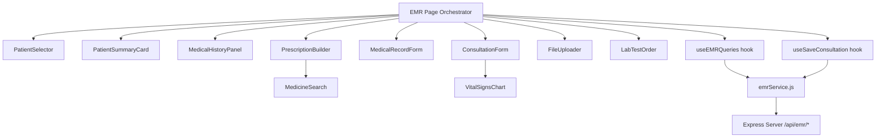

# EMR Module Enhancement Plan

## Current State

The Medico EMR module currently consists of:

| Layer | File | Lines | Description |
|-------|------|-------|-------------|
| Server | [`Medico/server.js`](Medico/server.js:530-750) | ~220 | In-memory Express API: prescriptions CRUD, medical records CRUD, patient medical history, patient search |
| Page | [`Medico/src/pages/EMR.jsx`](Medico/src/pages/EMR.jsx) | 854 | Monolithic component: patient selector, consultation form, medical record form, prescription builder |
| Service | [`Medico/src/services/emrService.js`](Medico/src/services/emrService.js) | 119 | API client: prescriptionService, medicalRecordService, patientService, appointmentService, doctorService |
| Types | [`Medico/src/types.js`](Medico/src/types.js) | 9 | Only `Role` enum |

**Reference implementations** exist in the `frontend/` directory (separate React app, not the active dev server):
- [`frontend/src/components/emr/PrescriptionBuilder.jsx`](frontend/src/components/emr/PrescriptionBuilder.jsx) — react-hook-form + zod validation
- [`frontend/src/components/emr/PatientSummaryPanel.jsx`](frontend/src/components/emr/PatientSummaryPanel.jsx) — react-query data fetching
- [`frontend/src/components/emr/FileUploadSection.jsx`](frontend/src/components/emr/FileUploadSection.jsx) — drag-drop with axios
- [`frontend/src/pages/emr/EMRConsultationEnhanced.jsx`](frontend/src/pages/emr/EMRConsultationEnhanced.jsx) — tabbed consultation with file upload

---

## Architecture Decisions

### 1. Target: Medico project only
All changes go into the **Medico** directory (the active dev server at `localhost:3000`). The `frontend/` and `backend/` directories are separate projects and will not be modified.

### 2. Component Architecture
Break the 854-line [`EMR.jsx`](Medico/src/pages/EMR.jsx) into modular components:

```
Medico/src/
├── pages/
│   └── EMR.jsx                    # Orchestrator (reduced to ~150 lines)
├── components/
│   └── emr/
│       ├── PatientSelector.jsx     # Extracted from EMR.jsx
│       ├── PatientSummaryCard.jsx  # Left panel patient info
│       ├── MedicalHistoryPanel.jsx # Enhanced history with expand/collapse
│       ├── ConsultationForm.jsx    # Vital signs, symptoms, diagnosis
│       ├── MedicalRecordForm.jsx   # Record type, title, description, diagnosis
│       ├── PrescriptionBuilder.jsx # Enhanced medicine builder with search
│       ├── MedicineSearch.jsx      # Autocomplete medicine search
│       ├── FileUploader.jsx        # Drag-drop file upload
│       ├── LabTestOrder.jsx        # Lab test ordering form
│       ├── VitalSignsChart.jsx     # Sparkline trend charts
│       └── PrescriptionPrint.jsx   # Print-friendly prescription layout
├── services/
│   └── emrService.js              # Extended with new endpoints
├── hooks/
│   ├── useEMRQueries.js           # React Query hooks for EMR data
│   └── useSaveConsultation.js     # Save logic extracted to hook
└── types.js                       # Extended with EMR-specific types
```

### 3. Server Architecture
Add new endpoints to [`Medico/server.js`](Medico/server.js) (keeping the in-memory pattern):

| Endpoint | Method | Purpose |
|----------|--------|---------|
| `/api/emr/upload` | POST | File upload (multipart) |
| `/api/emr/files/:patientId` | GET | List patient files |
| `/api/emr/files/:fileId` | DELETE | Delete a file |
| `/api/emr/medicines/search` | GET | Search medicine database |
| `/api/emr/medicines` | GET | List all medicines |
| `/api/emr/lab-tests` | GET | List available lab tests |
| `/api/emr/lab-orders` | POST | Create lab test order |
| `/api/emr/lab-orders/:patientId` | GET | Get patient lab orders |
| `/api/emr/vital-signs/:patientId` | GET | Get vital signs history |
| `/api/emr/allergies/:patientId` | GET | Get patient allergies |
| `/api/emr/allergies` | POST | Add patient allergy |

### 4. Data Flow



---

## Implementation Plan

### Phase 1: Foundation — Refactor & Types

**1.1 Extend types.js**
Add EMR-specific TypeScript-style JSDoc types:
- `Patient`, `Prescription`, `MedicalRecord`, `Medicine`, `VitalSigns`
- `LabTest`, `LabOrder`, `Allergy`, `UploadedFile`

**1.2 Extract components from EMR.jsx**
- `PatientSelector.jsx` — lines 61-134
- `PatientSummaryCard.jsx` — lines 350-400
- `ConsultationForm.jsx` — lines 480-638
- `MedicalRecordForm.jsx` — lines 641-762
- `PrescriptionBuilder.jsx` — lines 766-850

**1.3 Create custom hooks**
- `useEMRQueries.js` — React Query hooks for all EMR data fetching
- `useSaveConsultation.js` — extracted save logic (lines 228-302)

### Phase 2: File Upload

**2.1 Server: File upload endpoint**
- Add `multer` or use `express-fileupload` (or manual multipart parsing with `busboy`)
- Store files in `Medico/uploads/` directory
- Track files in in-memory `uploadedFiles` array
- Endpoints: POST `/api/emr/upload`, GET `/api/emr/files/:patientId`, DELETE `/api/emr/files/:fileId`

**2.2 Client: FileUploader component**
- Drag-and-drop zone with file type validation (PDF, JPEG, PNG, DICOM)
- File preview thumbnails
- Upload progress bar
- Delete uploaded files
- Associate files with patient + consultation

### Phase 3: Medicine Database & Enhanced Prescription Builder

**3.1 Server: Medicine database**
- In-memory medicine catalog (50+ common medicines with name, category, default dosage, contraindications)
- Search endpoint with fuzzy matching
- Drug interaction check endpoint

**3.2 Client: MedicineSearch component**
- Autocomplete dropdown with search-as-you-type
- Shows medicine name, category, default dosage
- Quick-fill dosage/duration on selection

**3.3 Client: Enhanced PrescriptionBuilder**
- Medicine search integration
- Drug interaction warnings (visual alerts)
- Better UX: frequency selector (OD, BD, TID, QID), timing (before/after meals)
- Dosage calculator based on age/weight

### Phase 4: Medical History Enhancement

**4.1 Enhanced MedicalHistoryPanel**
- Expandable/collapsible sections by type (Prescriptions, Lab Reports, Imaging, Consultations)
- Date range filtering
- Search within history
- Click to view full details in a slide-over panel
- Timeline visualization

### Phase 5: Lab Test Ordering

**5.1 Server: Lab test catalog & orders**
- In-memory lab test catalog (CBC, Lipid Profile, LFT, KFT, Thyroid, etc.)
- Lab order creation endpoint
- Lab order status tracking (ordered, sample_collected, processing, completed)

**5.2 Client: LabTestOrder component**
- Test catalog browser with search
- Multi-select tests with checkboxes
- Order summary with clinical justification
- View pending/completed orders for patient

### Phase 6: Prescription Print

**6.1 PrescriptionPrint component**
- Print-friendly CSS layout (A4 size)
- Includes: clinic header, patient info, diagnosis, medicines table, doctor signature placeholder
- Print button triggers `window.print()`
- Optional: generate PDF using browser print-to-PDF

### Phase 7: Vital Signs Trends

**7.1 Server: Vital signs history endpoint**
- Return all vital signs records for a patient sorted by date

**7.2 Client: VitalSignsChart**
- Sparkline charts using recharts (already in dependencies)
- Show BP, HR, Temp, Weight trends over time
- Inline in the consultation form next to current vitals input

### Phase 8: Allergy & Drug Interaction Warnings

**8.1 Server: Allergy endpoints**
- Patient allergy list (in-memory)
- Drug-allergy cross-reference check

**8.2 Client: Warning integration**
- Show allergy badges on patient summary card
- Drug interaction warnings in prescription builder
- Contraindication alerts when prescribing

---

## File Change Summary

| Action | File | Description |
|--------|------|-------------|
| MODIFY | `Medico/server.js` | Add file upload, medicine DB, lab tests, allergies, vital signs endpoints |
| MODIFY | `Medico/src/pages/EMR.jsx` | Refactor to orchestrator (~150 lines) |
| MODIFY | `Medico/src/services/emrService.js` | Add new API methods |
| MODIFY | `Medico/src/types.js` | Add EMR type definitions |
| CREATE | `Medico/src/components/emr/PatientSelector.jsx` | Extracted patient selector modal |
| CREATE | `Medico/src/components/emr/PatientSummaryCard.jsx` | Patient info card |
| CREATE | `Medico/src/components/emr/MedicalHistoryPanel.jsx` | Enhanced history panel |
| CREATE | `Medico/src/components/emr/ConsultationForm.jsx` | Consultation form |
| CREATE | `Medico/src/components/emr/MedicalRecordForm.jsx` | Medical record form |
| CREATE | `Medico/src/components/emr/PrescriptionBuilder.jsx` | Enhanced prescription builder |
| CREATE | `Medico/src/components/emr/MedicineSearch.jsx` | Medicine autocomplete |
| CREATE | `Medico/src/components/emr/FileUploader.jsx` | Drag-drop file upload |
| CREATE | `Medico/src/components/emr/LabTestOrder.jsx` | Lab test ordering |
| CREATE | `Medico/src/components/emr/VitalSignsChart.jsx` | Vital signs sparklines |
| CREATE | `Medico/src/components/emr/PrescriptionPrint.jsx` | Print-friendly prescription |
| CREATE | `Medico/src/hooks/useEMRQueries.js` | React Query hooks |
| CREATE | `Medico/src/hooks/useSaveConsultation.js` | Save consultation hook |
| CREATE | `Medico/uploads/.gitkeep` | Upload directory |